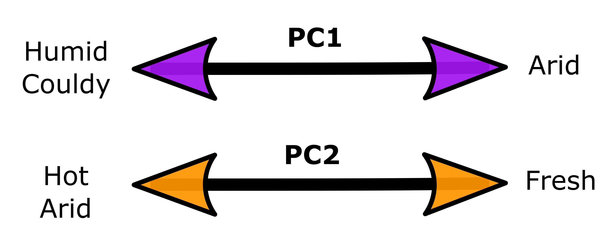

Ecological Variables

# Setting up 

Libraries sourced from an additional script

```{r, warning=FALSE, message=FALSE}
source("./MacroEcol_1_Libraries.R")
```

Ecological data was obtained from ALA and AWAP data bases through additional scripts (available in the scripts folder of this same project) 

```{r eval=FALSE}
#Data sourced from additional scripts:

#ALA Data
source("./1_ALA_variables.R")
#AWAP Data
source("./4_AWAPDailyQueries_2022.R")

```

We extracted the climate variables correspondent to the activity period of each species (see additional scripts for more details)

```{r message=FALSE}

vegeta <- read_csv("../Data/6_VegetationVariables.csv")
climat <- read_csv("../Data/7_ClimateVariables.csv")

```

The climate data we extracted contained many additional variables, but we decided to use only the most informative ones

```{r}

climat <- 
  climat %>% 
  filter (species != "xyle3" & 
          species != "oliv3") %>% # removed. vegetation data not available
  arrange (species) %>% 
  dplyr::select (c(1,5:8,11:19)) %>% 
  dplyr::rename(
    over35 = avg_temp_over_35, # days over 35deg averaged through 10 years
    MaxT = avg_max_temp, # daily -> mean in one month -> mean over 10 y
    MinT = avg_min_temp, # daily -> mean in one month -> mean over 10 y
    Solar = avg_sol, # daily radiation -> mean in month -> mean over 10 y
    Vapour =avg_vpr, # vapor pressure -> mean in month -> mean over 10 y
    Clouds = cloud_cover, # cloud cover per year 
    Rain = avg_rr) # rainfall per day -> mean in one month -> mean over 10 years

names(climat) 
# Suffix Coll = value for the parameter in the collection month. 
# No suffix = average value for this variable across the activity period

vegeta <- 
  vegeta %>% 
  filter (spp != "vrdi1"&
          spp != "rose05") %>% # removed. climate data not available
  arrange (spp) %>% 
  dplyr::select (c(1,11:18)) # Keep only the vegetation variables

names(vegeta) <- (c("beetle", "NPP", "BareSoil", "LeafArea",
                "FPAR", "Aridity", "C3Macro", "C3Meso", "C4Mega")) # rename

EcoVar <-
  data.frame(vegeta,climat) %>% 
  dplyr::select (- species) %>% 
  dplyr::select (c(1,6:16)) %>%  # Keep only variables for the period of activity 
  mutate (AridityN = Aridity * -1) %>%  # Because arid = closer to 0
  dplyr::select (- Aridity)

```

Some beetles were removed from the analysis because their position on the phylogeny is uncertain. 

```{r}

EcoVar <-
  EcoVar %>% 
  mutate (spp = substr(beetle, 1, 4)) %>% 
  filter (spp != "ambl"& # Amblyterus cicatricosus
          spp != "psqz"& # Pseudoschizongnatus schoenfeldti
          spp != "saul"& # Saulostomus villosus
          spp != "sqzb"& # Schizognathus burmeisteri
          spp != "sqzc"& # Schizognathus compressicornis
          spp != "sqzm"  # Schizognathus mesosternalis
            ) %>% # These species were removed. No phylogenetic info
  dplyr::select (-spp)

```


Finally we obtained the data frame `EcoVar` which contains all the relevant ecological variables for the relevant species.  

But before starting the analysis, we studied the correlations between the variables.


# Correlations 

We obtained the $R^2$ and correspondent p values for all combinations between the ecological variables.

```{r}

EVarP <- EcoVar[,c(2:length(EcoVar))] # remove the categorical variables

EVarMatP<- Hmisc::rcorr(as.matrix(EVarP)) 
EVarR2P <- round(EVarMatP$r, 2) # R2 values
EvarCpP <- round(EVarMatP$P, 5) # p  values

```

The following are the results for all variables including Vegetation and climate for activity period:

```{r}

EVarR2P %>%
  kbl() %>%
  kable_paper("hover", full_width = F)

EvarCpP %>%
  kbl() %>%
  kable_paper("hover", full_width = F)

```


Afterwards we removed the variables with correlations of R > 0.8

```{r}

EcolVar <- 
  EcoVar %>% 
  dplyr::select (- C3Macro, -C4Mega, -C3Meso, -MinT)

EVar <- EcolVar[,c(2:length(EcolVar))] # remove the categorical variables

EVarMat<- Hmisc::rcorr(as.matrix(EVar)) 
EVarR2 <- round(EVarMat$r, 2) # R2 values
EvarCp <- round(EVarMat$P, 5) # p  values

```

Finally, we considered only these variables:

```{r}

EVarR2 %>%
  kbl() %>%
  kable_paper("hover", full_width = F)

EvarCp %>%
  kbl() %>%
  kable_paper("hover", full_width = F)

```


# PCA
<br>

<span style="color: #04C799"> **Testing correlations** </span>  <br/>

Running a PCA is only possible if variables can be correlated:

```{r}
cord <- cor(EVar) # default: pearsons correlation coeficient
N <- dim(EVar)[1] # number of observations
cortest.bartlett(cord,n=N) # Are the variables correlated? Yes p < 0.05
```

Yes, they can be summarised in the new variables called components

<span style="color: #04C799"> **Extract components** </span>  <br/>

Here we extracted the eigen values, components and loadings matrix

```{r}


eigVal <- eigen(cord) # Extract eigen values
vectorev <- eigVal$vectors # vector with the eigen values
compv <- prcomp(EVar, retx=TRUE, center=TRUE, scale. = TRUE) # components
load<-compv$rotation # Loadings matrix 

```

<span style="color: #04C799"> **Scree Plot** </span>  <br/>

Represents the eigen values associated to each component. We used only the ones with eigen value > 1.

```{r}

{ plot(c(1:length(eigVal$values)),eigVal$values,type="b", cex=1.4,
     ylab="Eigen Values",xlab="Principal components",
     pch=21,bg="#04C799") 
abline(h=1,col="dodgerblue3",lwd=2,lty=2)}

```

<span style="color: #04C799"> **Variance Explained** </span>  <br/>

The following table shows the proportion of variance explained by each component.

```{r}

summary(compv)

```

PC1 and PC2 are able to explain 82% of all the variance in ecological habitats for our samples.

<br>

<span style="color: #04C799"> **Loadings Matrix** </span>  <br/>

The colours in the following figure represent the correlations of each variable is to each PC

```{r}

par(mar=c(4, 8, 4, 4))

plot(load[,1:2],cex=0.8,breaks=c(-1,-0.5,-0.4,-0.3,0.3,0.4,0.5,1),
     las=2,ylab=" ",xlab=" ",
     digits=2,
     col=c(
       "#762A83", "#AF8DC3",
       "#E7D4E8", "#F7F7F7",
       "#D9F0D3", "#7FBF7B",
       "#1B7837" 
     ),
     main="Loadings matrix ") 


```


Lower PC1 = higher humidity (vapour, rain and clouds) lower aridity.</br>

Lower PC2 = higher solar radiation, higher max temp, more days above 35 and more aridity


# Plot

```{r}
# brewer.pal(n = 7, name = "Accent")

# Extract PC axes for plotting
PCAvalues <- data.frame(Species = EcolVar$beetle, 
                        compv$x)

# Extract loadings of the variables
PCAloadings <- data.frame(Variables = rownames(compv$rotation), compv$rotation)

# PC1 vs PC2
ggplot(PCAvalues, aes(x = PC1, y = PC2)) +
  geom_point(fill="#39BEB1",col="black",pch=21,size=3.2,alpha=0.4)+
  theme_bw()+
  geom_text(data = subset (PCAvalues, PC1 > 2 | PC1 < -2.5 | PC2 < -2.5),
            alpha=.3, size=1, aes(label=Species),col="black")+
  annotate("text", size=3, 
           x = (PCAloadings$PC1*11.5), 
           y = (PCAloadings$PC2*11.5),
           label = (PCAloadings$Variables))+
  geom_segment(data = PCAloadings[c(1,2,3),], 
           aes(x = 0, y = 0, 
               xend = (PC1*11), yend = (PC2*11)), 
           arrow = arrow(
             length = unit(1/2,"picas")), 
             color = "#c23a58") +
  geom_segment(data = PCAloadings[c(4,5,6,7),], 
           aes(x = 0, y = 0, 
               xend = (PC1*11), yend = (PC2*11)), 
           arrow = arrow( 
             length = unit(1/2,"picas")), 
             color = "#3a97c2") +
  geom_hline(yintercept = 0, linetype ="dashed",colour="gray")+
  geom_vline(xintercept = 0, linetype ="dashed",colour="gray") +
  ylim(-10, 5) +
  xlim(-7, 5)

```

<br>
<br>

# Results from this step
<br>

We obtained a data frame with the PC values that summarise the ecological variables considered in our analysis.

```{r}
PC_Values <- PCAvalues[ , 1 : 3]
```


Then, we added the PC values to the consolidated files obtained in previous steps which includes the optical variables, size and phylogeny name:

<span style="color: #04C799"> **Reflectivity by individual** </span>  <br/>

```{r}

Cons1oo <- read.csv("../Data/FromCode/ConsolidatedReflectivityInd.csv") [-1]

Cons1 <- data.frame(Cons1oo, PC_Values) %>% 
  dplyr::select(-Species)

write.csv(Cons1,"../Data/FromCode/ConsReflEcolInd.csv")

names(Cons1)

```


<span style="color: #04C799"> **Absorptivity by individual** </span>  <br/>

```{r}

Cons2oo <- read.csv("../Data/FromCode/ConsolidatedAbsoptivityInd.csv") [-1]

Cons2 <- 
  PC_Values %>% 
  filter(Species %in% (Cons2oo$ind)) %>%  # Subset the PCA values
  arrange(Species) %>% 
  bind_cols(. , Cons2oo) %>% # join with the 'Optical' Data frame 
  dplyr::select(-Species) %>% 
  dplyr::select(ind, everything()) # rearrange the column order

write.csv(Cons2,"../Data/FromCode/ConsAbsEcolInd.csv")
  
names(Cons2)

```


# Meaning of each PC

<br>
<br>

**Lower PC1** = higher humidity: vapour, rain and clouds, which in turn correlates with more plant coverage.

**Lower PC2** = higher solar radiation and max temp, more days above 35 and more aridity.

<br>



```{r}
im<-load.image("../Data/RmdImages/PCarrows.png")
plot(im, axes = FALSE)